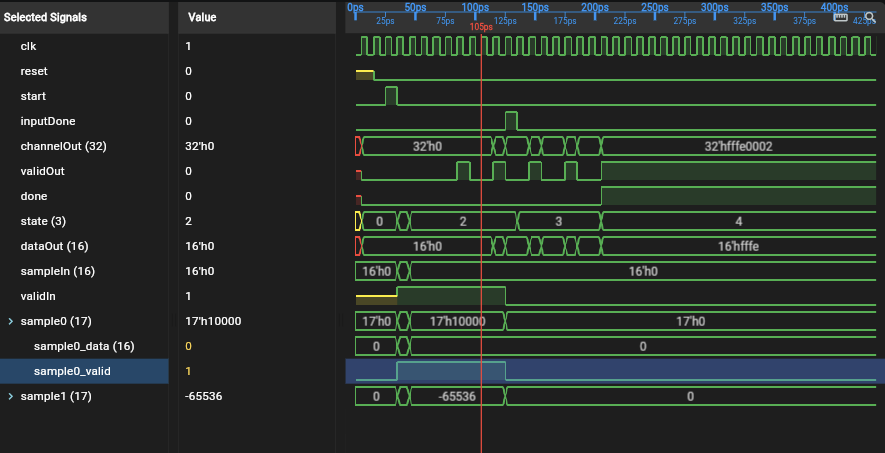

# ROHD Wave Viewer

[](https://github.com/intel/rohd-wave-viewer/actions/workflows/general.yml)
[](https://intel.github.io/rohd-wave-viewer/api/)
[](https://discord.gg/jubxF84yGw)
[](LICENSE)
[](CODE_OF_CONDUCT.md)
[](https://github.com/intel/rohd-wave-viewer/blob/main/.github/workflows/coverage.yml)

ROHD Wave Viewer is an interactive viewer for **VCD**, **FST**, and **GHW**
waveform files. It is designed for everyday waveform inspection in Visual
Studio Code or a web browser, with additional integration for ROHD designs and
other ROHD viewer extensions.

Use it to find signals in a design hierarchy, build and save a working signal
list, inspect values and transitions, measure time intervals, and move between
waveforms, schematics, and source code.

**[Open the hosted ROHD Wave Viewer](https://intel.github.io/rohd-wave-viewer/)**

[](doc/media/Waveform.mp4)

*Click the image to watch the ROHD Wave Viewer demo.*

## Embed the Viewer in a Flutter Application

Add the package to the host application:

```yaml
dependencies:
  rohd_wave_viewer: ^0.1.0
```

Then import the viewer and waveform data contracts and provide a
`SignalWaveformApi` together with the hierarchy maintained by the host:

```dart
import 'package:rohd_hierarchy/rohd_hierarchy.dart';
import 'package:rohd_wave_viewer/rohd_wave_viewer.dart';
import 'package:rohd_waveform/rohd_waveform.dart';

final hierarchy = BaseHierarchyAdapter.fromTree(
  myModuleStructure.modules.single,
);

runApp(
  EmbeddedWaveViewer(
    waveformApi: mySignalWaveformApi,
    externalHierarchy: hierarchy,
    title: 'My Waveform Viewer',
    isExtensionMode: true,
  ),
);
```

`isExtensionMode` hides standalone-only controls. The host supplies a
`SignalWaveformApi` implementation appropriate for its waveform data source
and a `HierarchyService` through `externalHierarchy`. Waveform APIs do not
provide generic hierarchy discovery; if the host starts from a
`ModuleStructure`, it can adapt the structure's root as shown above. The
complete runnable [embedding example](example/main.dart) obtains the mock
structure, adapts its hierarchy, and uses `MockSignalWaveformApi` from the
explicitly test-only `testing.dart` entry point. It therefore needs no waveform
file, native bridge, or WebAssembly setup.

The main `rohd_wave_viewer.dart` entry point exposes only
`EmbeddedWaveViewer`, `WaveViewerThemeMode`, and `WaveViewerHelpButton`.
Waveform data contracts come from `package:rohd_waveform`, hierarchy contracts
come from `package:rohd_hierarchy`, and cross-probing and source-navigation
contracts come from `package:rohd_devtools_widgets`.

The viewer's repositories, BLoCs, Cubits, painters, application shell, and
mutable caches are implementation details under `lib/src` and are not
supported package APIs.

## Choose How to Open the Viewer

### Visual Studio Code

The VS Code extension is the recommended option when waveform analysis is part
of an editing or debugging workflow.

After installing the extension:

1. Open a `.vcd`, `.fst`, or `.ghw` file from the Explorer.
2. If VS Code asks which editor to use, select **ROHD Wave Viewer**.
3. You can also run **ROHD Wave Viewer: Open** from the Command Palette.

The waveform opens as a custom editor in the current VS Code workspace. This
mode also enables integration with compatible ROHD extensions, including the
ROHD Schematic Viewer.

### Web Browser

Use the hosted application without installing an extension:

**[Open ROHD Wave Viewer](https://intel.github.io/rohd-wave-viewer/)**

Select a VCD, FST, or GHW file from your computer. The hosted viewer processes
the file locally in your browser; it does not upload the waveform to an
application server.

### Linux Desktop Application

A native Linux build opens the file picker when started without arguments. To
load a waveform immediately, pass it on the command line:

```bash
rohd_wave_viewer /path/to/design.fst
```

Linux package and executable names depend on the distribution. If you are
building the desktop application from source, see
[Developer Guide](doc/DEVELOPER.md).

## Quick Start

1. **Open a waveform file.**
2. **Select a module** in the hierarchy pane.
3. **Find signals** by browsing or typing in the signal filter.
4. **Double-click a signal** to add it to the monitored list.
5. **Click in the waveform** to place the primary time marker.
6. **Select one or more monitored signals** to navigate their transitions,
   change their format, reorder them, or send them to another ROHD viewer.

The main view is arranged as coordinated panes:

- **Hierarchy and module signals** select the part of the design to inspect.
- **Selected Signals** contains the ordered working set of monitored signals.
- **Values** shows each monitored value at the primary marker.
- **Waveforms** displays signal activity over time.

The dividers between panes can be resized. The hierarchy and toolbar can also
be pinned or hidden to provide more waveform space.

## Find and Add Signals

Select a module to display its ports and internal signals. Use the signal filter
to search by signal name or hierarchy path. Wildcards such as `*` and `?` can
be used to match related signals, and `Tab` completes a matching path or name.

Signals can be selected individually or in groups:

- **Click** selects one signal.
- **Ctrl/Cmd + Click** toggles a signal in the current selection.
- **Shift + Click** selects a range.
- **Ctrl/Cmd + A** selects all signals in the focused signal pane.
- **Double-click** adds a signal to the monitored list.
- The right-click menu can add or remove all selected signals.

Use the sort button to switch between ascending and descending signal names.
Internal signals can be shown or hidden from the toolbar.

## Work with Buses and Structured Signals

Multi-bit signals can be expanded into individual bits or selected ranges.
Named bit fields can be defined when a bus contains several logical values.

When ROHD hierarchy metadata is available, the viewer preserves structured
signal information rather than treating every value as an unrelated flat
signal. Structures, fields, arrays, bits, and slices can be expanded and added
to the monitored list independently.

This makes it possible to inspect a complete ROHD `LogicStructure` while also
monitoring only the fields or bit ranges relevant to the current problem.

## Organize the Monitored Signal List

The monitored list is a working view of the signals under investigation:

- Drag a row to reorder it.
- Select several rows and drag them as a group.
- Add the same source signal more than once when different formats or
  placements are useful.
- Remove focused rows with `Delete` or `Backspace`.
- Undo and redo monitor-list edits with the toolbar or standard
  `Ctrl/Cmd + Z` and redo shortcuts.

Signal display formats include:

- waveform
- binary
- hexadecimal
- octal
- unsigned decimal
- signed decimal
- ASCII

The chosen format is used consistently in the selected-signal, value, and
waveform panes.

## Navigate and Measure Waveforms

Click the waveform area to place the primary marker. Values at that time appear
in the Values pane.

Common navigation operations are:

| Action | Control |
| --- | --- |
| Pan through time | Scroll wheel or `Left` / `Right` |
| Scroll monitored signals | `Up` / `Down` |
| Zoom at the pointer | `Shift + Scroll` |
| Zoom in or out | `Shift + Up` / `Shift + Down` |
| Zoom into a time region | `Ctrl + Drag` from left to right |
| Zoom out with a region gesture | `Ctrl + Drag` from right to left |
| Fit the complete waveform | `F` |
| Jump to an adjacent transition | Focus a monitored signal, then press `Left` / `Right` |

Focused signals can be searched together for:

- the next or previous value change
- a rising edge
- a falling edge
- a matching value

The nearest matching transition across the focused set becomes the new marker
position.

An optional measurement marker shows the time difference from the primary
marker and the corresponding frequency. This is useful for checking periods,
latencies, pulse widths, and spacing between transactions.

## Save, Reload, and Share a View

Use the toolbar to:

- **Reload** the current waveform after regenerating it.
- **Save a signal list** as JSON.
- **Load a signal list** into another waveform session.
- **Export the visible viewer panes as PNG.**

Saved viewer state can retain monitored rows, value formats, signal filters,
markers, pane layout, and the waveform viewport. This allows an investigation
to be resumed without rebuilding the view manually.

## Send Signals Between ROHD Viewers in VS Code

When another compatible ROHD viewer is open in the same VS Code session, the
right-click menu includes **Send Signal** or **Send Signals**.

For example, with both ROHD Wave Viewer and ROHD Schematic Viewer open:

1. Select one or more signals in the module-signal or monitored-signal pane.
2. Right-click the selection.
3. Choose **Send Signal** or **Send Signals**.
4. The receiving viewer locates and selects the corresponding hierarchy paths.

This works in both directions:

- Send waveform signals to the Schematic Viewer to locate the associated nets.
- Send schematic nets to the Wave Viewer to add their recorded waveforms.

If a schematic internal net does not have its own recorded waveform, the
Schematic Viewer may also send a directly connected module output port or
parent-module input port so that a useful driving waveform can still be added.

The Send item is shown only when another registered viewer is available. If it
does not appear:

1. Confirm that both viewer extensions are installed and enabled.
2. Open both the waveform and schematic custom editors.
3. Reload the VS Code window if either extension was installed or updated while
   the window was already open.
4. Reopen both editors after the reload.

Signal sending between viewer extensions does not require a live ROHD debug
session. Live snapshots and streaming waveform updates are separate integration
features and may require a connected ROHD debugging service.

## Navigate to Source

When source-location information is supplied by the ROHD extension or an
embedding DevTools host, a signal's right-click menu can navigate to:

- **ROHD source**
- **SystemVerilog source**
- **SystemC source**

Only languages with confirmed source information are displayed. For example,
if a design has ROHD and generated SystemVerilog mappings but no SystemC
mapping, the menu shows only the ROHD and SystemVerilog actions.

## Live ROHD Debugging

When embedded in a compatible ROHD DevTools workflow, the viewer can receive
hierarchy and waveform information directly rather than opening a completed
waveform file. Depending on the host, integrated features can include:

- incremental waveform updates during simulation
- marker-time design snapshots
- live-tracking or video mode
- source navigation using recorded stack frames

These controls appear only when the host reports that the corresponding
service is available.

## Keyboard and Mouse Reference

| Task | Shortcut |
| --- | --- |
| Select one signal | Click |
| Extend or toggle selection | `Ctrl/Cmd + Click` |
| Select a range | `Shift + Click` |
| Select all signals in the focused pane | `Ctrl/Cmd + A` |
| Add signal to monitored list | Double-click |
| Reorder monitored signals | Drag selected row or rows |
| Remove focused monitored signals | `Delete` / `Backspace` |
| Undo monitor-list edit | `Ctrl/Cmd + Z` |
| Redo monitor-list edit | `Ctrl/Cmd + Y` or `Ctrl/Cmd + Shift + Z` |
| Complete signal search | `Tab` |
| Clear signal search | `Esc` |
| Fit waveform | `F` |
| Place primary marker | Click waveform |
| Jump between transitions | Focus signal, then `Left` / `Right` |

The in-application Help button contains the current toolbar and shortcut
reference. See [signal filtering](doc/SIGNAL_FILTERING.md) for additional
examples.

## Troubleshooting

### A waveform does not open

- Confirm that the file extension is `.vcd`, `.fst`, or `.ghw`.
- Verify that waveform generation completed and the file is not empty.
- If the file was replaced while open, use **Reload**.

### A signal is missing

- Select the correct module in the hierarchy.
- Clear the signal filter with `Esc`.
- Enable internal signals from the toolbar.
- For a bus or structure, expand its fields, bits, or ranges.
- Some internal nets are optimized away or are not recorded by the waveform
  producer.

### Send is not in the right-click menu

**Send Signal(s)** is intentionally hidden until another compatible ROHD viewer
registers in the current VS Code session. Open the other viewer, or reload the
VS Code window after installing or updating its extension.

### Source navigation is not in the right-click menu

Source actions appear only for languages whose mappings are available for the
selected module. Open the design through the ROHD extension or a compatible
DevTools workflow that supplies source information.

## Development and Contributions

This README is the user guide. Instructions for building the application,
running Flutter configurations, packaging the VS Code extension, selecting
local dependencies, and running tests are in the
[Developer Guide](doc/DEVELOPER.md).

- [Join the Discord chat](https://discord.gg/jubxF84yGw)
- [Report an issue](https://github.com/intel/rohd-wave-viewer/issues)
- [Contributing guide](CONTRIBUTING.md)

---

Copyright (C) 2024-2026 Intel Corporation
SPDX-License-Identifier: BSD-3-Clause
