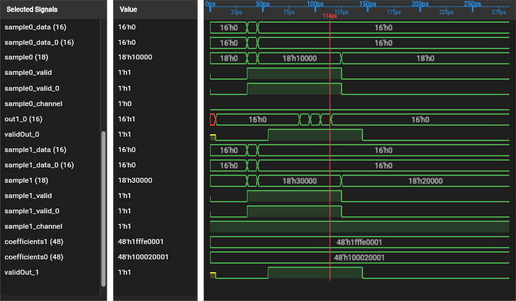

# 🌊 ROHD Wave Viewer

An interactive waveform viewer for **VCD**, **FST**, and **GHW** files, running
directly inside VS Code.  Part of the [ROHD](https://intel.github.io/rohd-website)
hardware design ecosystem.

[](waveform-demo.mp4)

*Click the image to watch the viewer load a filter bank waveform and explore its signals.*

<!--
Publishing checklist for https://github.com/intel/rohd-wave-viewer:
1. After the GitHub repository exists, upload vscode-extension/waveform-demo.mp4 as a
   video/mp4 GitHub user attachment associated with intel/rohd-wave-viewer.
2. Replace the linked poster and caption above with the returned
   https://github.com/user-attachments/assets/... URL on its own line so GitHub
   renders the inline video player.
3. Verify playback from the rendered README, then delete the committed MP4 if
   the local fallback is no longer wanted.
-->

## Features

- **Open waveform files** — double-click any `.vcd`, `.fst`, or `.ghw` file
  and it renders in a custom editor tab.
- **Pan & Zoom** — keyboard arrows, scroll wheel, Ctrl+drag region zoom, and
  press **F** to fit the entire waveform to the viewport.
- **Time marker** — click any waveform row to place a time cursor; jump to
  previous/next transitions across focused signals with ←/→.
- **Signal filtering** — filter the current module by name, hierarchy path, or
  case-insensitive prefix or `*`/`?` wildcard; use Tab for path completion.
- **Module tree** — hierarchical module browser; click to expand/collapse and
  filter signals by module.
- **Signal monitor list** — double-click or use the context menu to add
  signals; multi-select, drag to reorder, and remove with Delete or Backspace.
  Save or load the ordered monitor list as JSON.
- **Structured signals** — expand arrays and structures or define monitored
  bit ranges when hierarchy metadata is available.
- **Reload from disk** — re-read the waveform file without closing the tab
  (useful during simulation reruns).
- **Internal signal visibility** — toggle display of internal implementation
  signals.
- **Light / Dark theme** — toggle the viewer theme manually.
- **PNG export** — save the selected-signal, value, and waveform panes through
  the native VS Code save dialog.
- **Source navigation** — navigate selected signals to ROHD or generated
  SystemVerilog when the companion ROHD extension and source metadata are
  available.
- **Cross-probe** — send selected signals between registered wave and
  schematic viewers through the companion ROHD extension.

## Keyboard Shortcuts

| Key | Action |
| --- | --- |
| ← / → | Pan left / right |
| ↑ / ↓ | Scroll signals up / down |
| Shift+↑ / Shift+↓ | Zoom in / out |
| Shift+Scroll | Zoom at cursor |
| Scroll | Pan horizontally |
| F | Fit waveform to viewport |
| Ctrl+Drag | Zoom to time region |
| Ctrl/Cmd+Click | Toggle signal selection |
| Shift+Click | Select a signal range |
| Ctrl/Cmd+A | Select all signals in the focused signal pane |
| Tab | Complete the module-signal filter |
| Esc | Clear the module-signal filter |
| Delete / Backspace | Remove focused signals from monitor |

## Toolbar

| Button | Action |
| --- | --- |
| 🔄 Reload | Re-read waveform from disk |
| 💾 Save list | Save monitored signal names to JSON |
| 📂 Load list | Restore monitored signals from JSON |
| Export PNG | Save the viewer panes as an image |
| 👁 Internals | Toggle visibility of internal signals |
| ☀️/🌙 Theme | Toggle light / dark theme |

## Commands

| Command | Title |
| --- | --- |
| `rohd-wave-viewer.open` | ROHD Wave Viewer: Open |

## Installation

### From VSIX

```bash
make install-local
```

This builds `build/rohd-wave-viewer-<version>.vsix`, installs it with the VS
Code CLI, and replaces an older installed version. Reload the VS Code window
after installation.

### Development Build

Run extension builds from the repository root:

```bash
make extension
```

This compiles the TypeScript host, builds the patched Flutter web application,
and stages the complete extension under
`build/extension/rohd-wave-viewer-<version>/`. The same command also produces
`build/rohd-wave-viewer-<version>-slim.zip`.

## Building the Extension Package

```bash
make vsix
```

Do not run `vsce package` directly in `vscode-extension/`. The source
directory intentionally does not contain the generated Flutter web and
WebAssembly assets. `make vsix` packages the staged output created by the
supported build pipeline.

To compile only the TypeScript host while editing it:

```bash
cd vscode-extension
npm install
npm run compile
```

That command does not create a runnable or publishable extension package.

## Requirements

Extension builds require the repository's pinned Flutter, Rust, WebAssembly,
native build, and Node.js toolchains. See the
[build and environment guide](../doc/BUILD.md).

---

Copyright (C) 2024-2026 Intel Corporation
SPDX-License-Identifier: BSD-3-Clause
